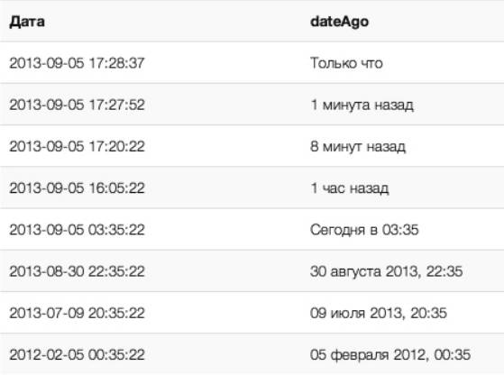

# Laravel dateAgo

## Installation

Require this package with composer. 

```bash
composer require gjpbw/date-ago
```
---------

**Laravel <5.5**
After updating composer, add the service provider to the `providers` array in `config/app.php`

```php
Gjpbw\DateAgo\DateAgoServiceProvider::class,
```
**Laravel >=5.5** uses Package Auto-Discovery, so doesn't require you to manually add the ServiceProvider.

--------

## Publishing

```bash
php artisan vendor:publish --provider="Gjpbw\DateAgo\DateAgoServiceProvider"
```


## Using

```
dateAgo($date)
```
---------

## Result

